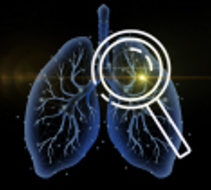

<table>
<tr>
<td></td>
<td><h1>LuCaFound: A Disease-specific Vision–Language Foundation Model for Comprehensive Clinical Assessment in Lung Cancer</h1></td>
</tr>
</table>


LuCaFound is a **disease-specific vision–language foundation model** trained on large-scale chest CTs and paired radiology reports.  
It provides a unified framework for **efficient feature extraction** and **transfer learning**, facilitating downstream applications such as **histology classification, EGFR mutation prediction, staging, and prognosis assessment**.


**Weights**: Pretrained encoder weights are available here → [model.pt](https://github.com/chengcailiu/LuCaFound/releases/download/weight/model.pt).  

---

## 1. Data

Public datasets used in this study are listed below. Additional datasets are subject to access restrictions, but may be made available for academic research upon reasonable request to the corresponding author (shuo_wang@buaa.edu.cn).  

| Dataset    | URL                                                                                                                                                  |
| ---------- | ---------------------------------------------------------------------------------------------------------------------------------------------------- |
| DLCSD24    | [https://zenodo.org/records/10782891](https://zenodo.org/records/10782891)                                                                           |
| LUNA16     | [https://luna16.grand-challenge.org](https://luna16.grand-challenge.org/)                                                                            |
| TCIA       | [NSCLC Radiogenomics](https://wiki.cancerimagingarchive.net/display/Public/NSCLC+Radiogenomics)                                                      |
| LUNG1      | [NSCLC Radiomics](https://www.cancerimagingarchive.net/collection/nsclc-radiomics)                                                                   |
| UCSF-PDGM  | [UCSF-PDGM](https://www.cancerimagingarchive.net/collection/ucsf-pdgm)                                                                               |
| LUNG-PET   | [Lung PET-CT DX](https://www.cancerimagingarchive.net/collection/lung-pet-ct-dx)                                                                     |
| DEEPLESION | [DeepLesion](https://nihcc.app.box.com/v/DeepLesion)                                                                                                 |
| CT-RATE    | [CT-RATE](https://huggingface.co/datasets/ibrahimhamamci/CT-RATE)                                                                                    |

---

## 2. Code Usage

This section details environment setup, data preprocessing, model initialization, and feature extraction.  

### 2.1 Environment Setup

We recommend using **conda** with the provided `environment.yml`:  

```bash
# Create and activate environment
conda env create -f environment.yml
conda activate lucafound

# Install local package
pip install -e .
```

---

### 2.2 Data Preprocessing (`data_preprocess.py`)

Automated preprocessing is provided to handle **DICOM series** or **NIfTI files**.  

```bash
python data_preprocess.py   --img_path /path/to/CT.nii.gz   --cuda 0
```

- `--img_path`: path to CT image (NIfTI `.nii/.nii.gz` or DICOM directory)  
- `--cuda`: GPU ID (e.g., `0`); defaults to CPU if unspecified  

Outputs include the processed CT volume and lung mask saved under `./processed/`.  

---

### 2.3 Model Definition & Weight Loading (`model.py`)

The model encoder and weight-loading utilities are provided in `model.py`.  

```python
from model import ModelforExtractFea
import argparse

parser = argparse.ArgumentParser()
parser.add_argument('--pretrained', type=str, default='./weights/model.pt', help='path to pretrained model')
parser.add_argument('--save_feature', type=bool, default=True, help='save intermediate features')
args = parser.parse_args()

# Initialize model
model = ModelforExtractFea(args=args)
```

---

### 2.4 Feature Extraction (`extract_features.py`)

```python
from model import ModelforExtractFea
from extract_features import data_process
import argparse

parser = argparse.ArgumentParser()
parser.add_argument('--pretrained', type=str, default='./weights/model.pt', help='path to pretrained model')
parser.add_argument('--save_feature', type=bool, default=True, help='save feature')
parser.add_argument('--cuda', type=str, default='0', help='cuda device')
parser.add_argument('--img_path', type=str, default='', help='Preprocessed NIfTI image file')
args = parser.parse_args()

# Preprocess input image
img = data_process(args.img_path)

# Load encoder
model = ModelforExtractFea(args=args)

# Extract features
feature = model(img)
print("Feature shape:", feature.shape)  # e.g. [1, 1024]

```

The extracted **1024-d feature vector** can be directly applied to:  
- Downstream classification/regression (e.g., histology, EGFR mutation)  
- Multi-modal fusion with clinical or textual data  
- Transfer learning on new datasets  

---

### 🔎 Note on Fine-tuning

For fine-tuning, you can easily use the provided model to adapt to your specific task by training it on your dataset.

---
