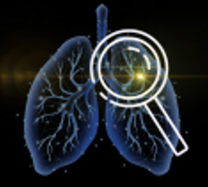

<table>
<tr>
<td></td>
<td><h1>LuCaFound: A Disease-specific Vision–Language Foundation Model for Comprehensive Clinical Assessment in Lung Cancer</h1></td>
</tr>
</table>


LuCaFound is a **disease-specific vision–language foundation model** trained on large-scale chest CTs and paired radiology reports.  
It provides a unified framework for **efficient feature extraction** and **transfer learning**, facilitating downstream applications such as **histology classification, EGFR mutation prediction, staging, and prognosis assessment**.


**Weights**: Pretrained encoder weights are available here → [model.pt](https://github.com/chengcailiu/LuCaFound/releases/download/weight/model.pt).  
**Update**: We have updated the pretraining code. If you want to pretrain on your own dataset, please go to the `/pretrain` folder.

---

## 1. Data

Public datasets used in this study are listed below. Additional datasets are subject to access restrictions, but may be made available for academic research upon reasonable request to the corresponding author or the first author (shuo_wang@buaa.edu.cn).  

| Dataset     | URL                                                                                            |
|-------------|------------------------------------------------------------------------------------------------|
| DLCSD24     | [DLCSD24](https://zenodo.org/records/10782891)                     |
| LUNA16      | [LUNA16](https://luna16.grand-challenge.org/)                       |
| TCIA        | [NSCLC Radiogenomics](https://wiki.cancerimagingarchive.net/display/Public/NSCLC+Radiogenomics) |
| LUNG1       | [NSCLC Radiomics](https://www.cancerimagingarchive.net/collection/nsclc-radiomics)             |
| UCSF-PDGM   | [UCSF-PDGM](https://www.cancerimagingarchive.net/collection/ucsf-pdgm)                         |
| LUNG-PET    | [Lung PET-CT DX](https://www.cancerimagingarchive.net/collection/lung-pet-ct-dx)               |
| DEEPLESION  | [DeepLesion](https://nihcc.app.box.com/v/DeepLesion)                                           |
| CT-RATE     | [CT-RATE](https://huggingface.co/datasets/ibrahimhamamci/CT-RATE)                              |
| RAD-ChestCT | [RAD-ChestCT](https://zenodo.org/records/6406114)                                              |
| TCIA NSCLC Radiogenomics        | [TCIA NSCLC Radiogenomics](https://www.ncbi.nlm.nih.gov/geo/query/acc.cgi?acc=GSE103584)                                                                   |

---

## 2. Code Usage

This section details environment setup, data preprocessing, model initialization, and feature extraction.  

### 2.1 Environment Setup (`environment.yml` or `requirements.txt`)

We provide **two optional methods** to set up the running environment; you can choose either based on your needs:

First, you are encouraged to download this repository and navigate to the `LuCaFound-main/` directory.

#### Method 1: Use `environment.yml` (Recommended, One-Click Deployment)
This method leverages the pre-configured `environment.yml` file to create a Conda environment, ensuring consistent dependency versions across different systems.

```bash
# Create Conda environment from environment.yml
conda env create -f environment.yml

# Activate the environment
conda activate lucafound
```
#### Method 2: Manual Creation with Specified Python Version (Flexible, Optional Mirror Acceleration)
This method manually specifies `Python 3.12.7` to create a Conda environment and installs dependencies via `requirements.txt`, offering flexibility for custom environment configurations.

Note: The `-i https://pypi.tuna.tsinghua.edu.cn/simple/` parameter is optional. It accelerates package downloads using the Tsinghua University PyPI mirror.

```bash
# Create Conda environment named "lucafound" with Python 3.12.7
conda create -n lucafound python=3.12.7 -y

# Activate the environment
conda activate lucafound

# Install dependencies (choose one of the following)
# Option 1: Use official PyPI source (default)
pip install -r requirements.txt

# Option 2: Use Tsinghua PyPI mirror for acceleration (optional)
pip install -r requirements.txt -i https://pypi.tuna.tsinghua.edu.cn/simple/
```

---

### 2.2 Data Preprocessing (`data_preprocess.py`)

Automated preprocessing is implemented to support both **DICOM series** and **NIfTI files**.  

```bash
# Our original pipeline is as follows:
python data_preprocess.py   --img_path CT_example/   --cuda 0
# CT_example/ is an example directory containing DICOM series

# We also provide a MONAI pipeline for data preprocessing:
python monai_pipeline/data_preprocess.py   --img_path CT_example/   --cuda 0
# CT_example/ is an example directory containing DICOM series
```

- `--img_path`: path to CT image (NIfTI `.nii/.nii.gz` or DICOM directory)  
- `--cuda`: GPU ID (e.g., `0`); defaults to CPU if unspecified
- `--output_dir`: path to save processed CT volume and lung mask (default: `./processed/`)
- `--target_size`: target size for resizing CT volume (default: `[48, 256, 256]`)
- `inferer = LMInferer(batch_size=1)`: batch size for inference is set to 1, for minimum memory consumption, which is suitable for most applications.

Outputs (the processed CT volume and lung mask) are saved under `./processed/` if `--output_dir` is not specified.  

---

### 2.3 Model Definition & Weight Loading (`model.py`)

The model encoder and weight-loading utilities are provided in `model.py`.  
**Please download the pretrained weights** from the [release link](https://github.com/chengcailiu/LuCaFound/releases/download/weight/model.pt) and place the file under the local directory `./weights` before running the following code. We have updated the pretraining code. If you want to pretrain on your own dataset, please go to the `/pretrain` folder.

```python
from model import ModelforExtractFea
import argparse

parser = argparse.ArgumentParser()
parser.add_argument('--pretrained', type=str, default='./weights/model.pt', help='path to pretrained model')
args = parser.parse_args()

# Initialize model
model = ModelforExtractFea(args=args)
```
- `--pretrained`: path to the pretrained model, defaults to `./weights/model.pt`


---

### 2.4 Feature Extraction (`extract_features.py`)

```bash
# Our original pipeline is as follows:
python extract_features.py --img_path processed/1.3.6.1.4.1.32722.99.99.23507740616018260882925674231000042364_img.nii.gz --cuda 0
# We also provide a MONAI pipeline for feature extraction:
python monai_pipeline/extract_features.py --img_path processed/1.3.6.1.4.1.32722.99.99.23507740616018260882925674231000042364_img.nii.gz --cuda 0
# processed/1.3.6.1.4.1.32722.99.99.23507740616018260882925674231000042364_img.nii.gz is an example directory containing processed CT volume
```
- `--img_path`: path to processed CT volume (NIfTI `.nii/.nii.gz`)
- `--cuda`: GPU ID (e.g., `0`); defaults to CPU if unspecified

The extracted **1024-d feature vector** can be directly applied to:  
- Downstream classification/regression (e.g., EGFR mutation)  
- Multi-modal fusion with clinical or textual data  
- Transfer learning on new datasets  

---

### 🔎 Note on Fine-tuning

For fine-tuning, the provided model can be readily adapted to specific tasks by training on user-defined datasets.

---
